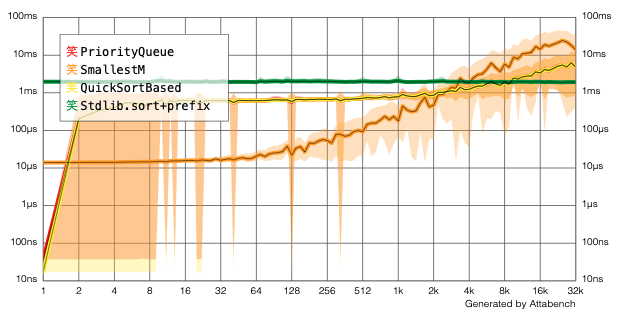
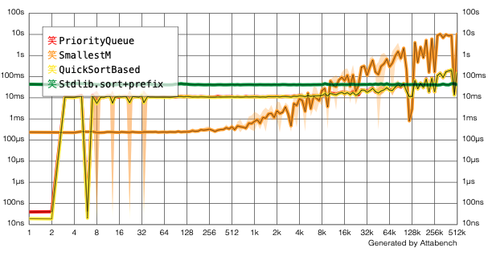

# Minima and/or Maxima

[[Source](https://github.com/apple/swift-algorithms/blob/main/Sources/Algorithms/MinMax.swift) | 
 [Tests](https://github.com/apple/swift-algorithms/blob/main/Tests/SwiftAlgorithmsTests/MinMaxTests.swift)]

Returns the smallest or largest elements of this collection, sorted by a 
predicate or in the order defined by `Comparable` conformance.

If you need to sort a collection but only need access to a prefix or suffix of 
the sorted elements, using these methods can give you a performance boost over 
sorting the entire collection. The order of equal elements is guaranteed to be 
preserved.

```swift
let numbers = [7, 1, 6, 2, 8, 3, 9]
let smallestThree = numbers.min(count: 3, sortedBy: <)
// [1, 2, 3]
```

Return the smallest and largest elements of this sequence, determined by a 
predicate or in the order defined by `Comparable` conformance.

If you need both the minimum and maximum values of a collection, using these 
methods can give you a performance boost over running the `min` method followed 
by the `max` method. Plus they work with single-pass sequences.

```swift
let numbers = [7, 1, 6, 2, 8, 3, 9]
if let (smallest, largest) = numbers.minAndMax(by: <) {
    // Work with 1 and 9....
}
```

## Detailed Design

This adds the `Collection` methods shown below:

```swift
extension Collection {
    public func min(
        count: Int, 
        sortedBy areInIncreasingOrder: (Element, Element) throws -> Bool
    ) rethrows -> [Element]
    
    public func max(
        count: Int, 
        sortedBy areInIncreasingOrder: (Element, Element) throws -> Bool
    ) rethrows -> [Element]
}
```

And the `Sequence` method:

```swift
extension Sequence {
    public func minAndMax(
        by areInIncreasingOrder: (Element, Element) throws -> Bool
    ) rethrows -> (min: Element, max: Element)?
}
```

Additionally, versions of these methods for `Comparable` types are also 
provided:

```swift
extension Collection where Element: Comparable {
    public func min(count: Int) -> [Element]

    public func max(count: Int) -> [Element]
}

extension Sequence where Element: Comparable {
    public func minAndMax() -> (min: Element, max: Element)?
}
```

### Complexity

The algorithm used for minimal- or maximal-ordered subsets is based on 
[Soroush Khanlou's research on this matter](https://khanlou.com/2018/12/analyzing-complexity/). 
The total complexity is `O(k log k + nk)`, which will result in a runtime close 
to `O(n)` if *k* is a small amount. If *k* is a large amount (more than 10% of 
the collection), we fall back to sorting the entire array. Realistically, this 
means the worst case is actually `O(n log n)`.

Here are some benchmarks we made that demonstrates how this implementation 
(SmallestM) behaves when *k* increases (before implementing the fallback):




The algorithm used for simultaneous minimum and maximum is slightly optimized. 
At each iteration, two elements are read, their relative order is determined, 
then each is compared against exactly one of the current extrema for potential 
replacement. When a comparison predicate has to analyze every component of both 
operands, the optimized algorithm isn't much faster than the straightforward 
approach. But when a predicate only needs to compare a small part of each 
instance, the optimization shines through.

### Comparison with other languages

**C++:** The `<algorithm>` library defines a `partial_sort` function where the 
entire array is returned using a partial heap sort. It also defines a 
`minmax_element` function that scans a range for its minimal and maximal 
elements.

**Python:** Defines a `heapq` priority queue that can be used to manually 
achieve the same result.

